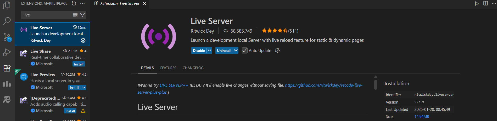
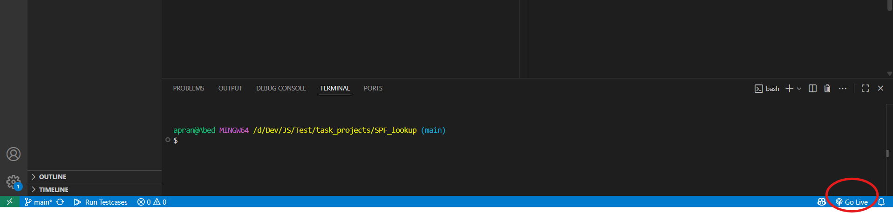
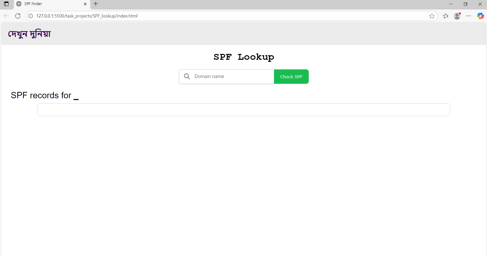

# SPF Lookup

## ⚙️ Tools Needed

- Install the **VSCode Live Server** extension.

## 🚀 Running the Project

1. Clone the repository:

   > `git clone <https|SSH path>`

2. Open the cloned repository in VSCode.
3. Open the `index.html` file.
4. Click the `Go Live` button at the bottom-right corner of VSCode.
   > 
   > This will open the application in your default browser on `localhost`. Like this:
   > 

## ☁️ Live URL

If you prefer not to set up locally, you can view the live version [here](https://spflookup.pages.dev).
